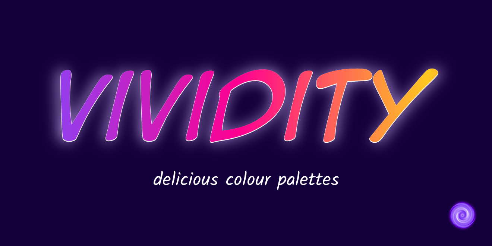

Y’know what, customisation is awesome, and not enough things have it.

If you’re just looking for a cool colour palette to use in a project, check out the [site lkext ](https://sup2point0.github.io/vividity) where you can check out exactly what they look like.

Wait, vividity isn’t a real word? Well why shouldn’t it be 0v0

 

## Usage

### Git Submodule
See [Vividity as a Git Submodule](docs/usage/submodule.md).

### API
Under development!
